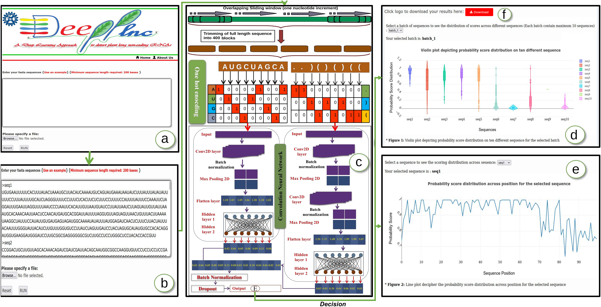

# DeepPlnc

## Introduction

Long non-coding RNAs (lncRNAs), characterized as RNA transcripts longer than 200 nucleotides without functional open reading frames, play critical regulatory roles in various biological and developmental processes in both animals and plants. Despite their recent discovery and intriguing potential functions, lncRNA characterization remains a significant challenge, particularly in plants due to limited information, distinct transcriptional patterns, low sequence conservation, and scarce resources for credible annotation in plant genomes and transcriptomes. This highlights the need for novel tools to effectively identify and characterize plant lncRNAs.

We introduce DeepPlnc, a deep learning-based software for accurately identifying plant lncRNAs across various plant genomes. Unlike most existing tools, DeepPlnc can even annotate incomplete length transcripts. It employs a bi-modal architecture of Convolutional Neural Networks (CNNs) to extract information from both the nucleotide sequence and secondary structure of plant lncRNAs, enabling accurate lncRNA identification.

## 1. Data information
The user needs to provide RNA-seq data or any nucleotide sequence data in a fasta format as an input. This data undergoes analysis via trained bi-modal Convolutional Neural Networks (CNNs), resulting in the generation of scores allocated to each provided sequence. These scores serve as an output, offering insights or assessments derived from the analysis conducted by the CNNs.

## 2. Webserver
A webserver for lncRNAs detection has been established at https://scbb.ihbt.res.in/DeepPlnc/. User can identify lncRNAs by providing FASTA sequences as input. There is an download option for the result in the tabular format where the first column indicates sequence ID and second column represents whether it is lncRNA or not.
<br>
<br />
<p align="center">

</p>
<p align="center"><b>Figure: DeepPlnc webserver implementation</b></p> 

## 3. Environment setup
#### 3.1 Install the package and other requirements
1. Python3.6 or higher
2. Numpy
3. keras
4. tensorflow
5. plotly
6. pandas
7. <a href=https://www.tbi.univie.ac.at/RNA/>RNAfold</a> 
9. python module multiprocessing, Bio, bayesian-optimization
<br>
Download and extract the source code for DeepPlnc, and then unzip this parent directory. Type the following commands:

```
git clone https://github.com/SCBB-LAB/DeepPlnc.git
cd DeepPlnc
unzip DeepPlnc.zip
```

#### 3.2. File description

In the parent directory, you will find a collection of files that are described below:

1. **`DeepPlnc.sh`** = Complete execution script.
2. **`DeepPlnc.py`** = Python script for detecting lncRNAs from sequences provided.
3. **`Model_A.h5`** = Trained model have traditionally considered negative dataset (mRNA sequences).
4. **`Model_B.h5`** = Trained model has one-third of the negative dataset having plant rRNAs and tRNAs, along with two-third of it having mRNAs.
5. **`test`** = Fasta sequence. (Minimum 200 bases in length)
6. **`make-plot.py`** = Python script for box and violin plot generation for a single sequence.
7. **`batch-plot.py`** = Python script for violin plot generation for a batch (10 sequence).
8. **`predict_GPU.py`** = Python script for detecting lncRNAs utilizing GPU.
9. **`file_format_GPU`** = File format of input for script predict_GPU.py. file containing seq_id, sequence (sequence length of >= 200 bases but not > 400 bases), and secondary structure generated using RNAfold software (in dot bracket representation) separated by tabs.
10. **`model_hyper.py`** = Python script used to build model implementing hyperparameter tuning.


## 4. Running script
### 4.1 Prediction of the lncRNAs
For the identification of lncRNAs, execute following command in the parent directory:

```
sh DeepPlnc.sh test /usr/local/bin/ A
```
- **test** = Test file
- **/usr/local/bin/** = Path of RNAfold in your local system
- **A** = Model to be selected for classification (Options : A|B)

  
**Output:** Two files, namely `test.txt` and `test_results.tsv`, are generated that contains `chunks wise probability score of the sequence provided` and `classification result of the sequence provided`.

### 4.2 Prediction of the lncRNAs using GPU
To detect lncRNA using GPU, Run the following command: 

```
python3 predict_GPU.py file_format_GPU A
```
- **file_format_GPU** = File format of input for script predict_GPU.py. file containing seq_id, sequence (sequence length of >= 200 bases but not > 400 bases), and secondary structure generated using RNAfold software (in dot bracket representation) separated by tabs.
- **A** = Model to be selected for classification (Options : A|B)

  
**Output:** One file, namely `file_format_GPU_prediction.txt`, is generated that contains `chunks wise probability score of the sequence provided`.

### 4.3 Hyper-parameter optimization

To build model implementing hyperparameter tuning, run the following command:
```
python3 model_hyper.py file_for_tuning
```
- **file_format_GPU** = File format of input for script predict_GPU.py. file containing seq_id, sequence (sequence length of >= 200 bases but not > 400 bases), and secondary structure generated using RNAfold software (in dot bracket representation) separated by tabs.

  
**Output:** Two files, namely `seq.txt` and `struc.txt`, are generated that contains `hyparameters for sequence side of bi-modal` and `hyparameters for structure side of bi-modal`.

### 4.4 Visualization

- To plot box and violin plot for a single sequence, switch to directory name **`plot`** and execute following command:

```
python3 ../make-plot.py seq1 (sequences file name without ".csv")
```

- To plot violin plot for a batch (10 sequence), switch to directory name **`plot`** and execute following command:

```
python3 ../batch-plot.py batch_1 (batch file name without ".csv")
```


**Output:** The plot is generated for a single sequence and for a batch of 10 sequences.
**Note:** When you run DeepPlnc, please make sure there are no folder named "plot" in parent directory, otherwise it will give unnecessary warning:

`mkdir: cannot create directory plot: File exists`

==================
*Output description*
==================

lncRNA detection module (DeepPlnc) gives output in following format 

1. test.txt = Chunks wise probability score of the sequence provided.
2. test_results.tsv = Classification result of the sequence provided.
3. plot = folder containing "csv" files to construct violin and line plot.
4. seq.txt = Hyparameters for sequence side of bi-modal
5. struc.txt = Hyparameters for structure side of bi-modal

==================
*Citation*
==================

Citation: Ritu, Gupta S, Sharma NK, Shankar R (2022) DeepPlnc: Discovering plant lncRNAs through multimodal deep learning on sequential data. Genomics, 2022. https://www.sciencedirect.com/science/article/pii/S0888754322001884
